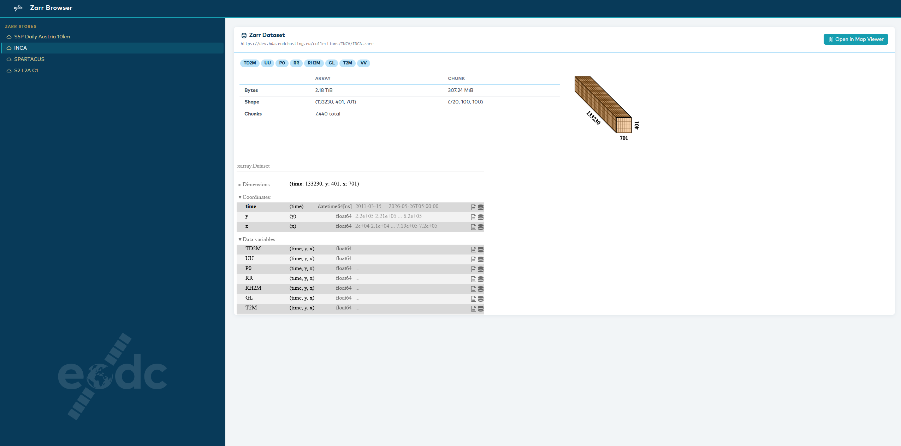

# EODC Zarr Browser

A Plotly Dash web application for browsing and inspecting remote Zarr stores over HTTP. Displays xarray metadata, chunk structure, and array statistics directly in the browser without downloading data.



## Features

- Browse remote Zarr v2 and v3 stores over HTTP
- Hierarchical sidebar navigation with subgroup support
- Tiled stores (e.g. Sentinel-2 UTM tiles) with tile and resolution selection
- xarray dataset metadata: variables, shape, chunk layout, byte sizes
- Optional map viewer button integration
- Client-side navigation (no full page reloads)
- EODC branding

## Configuration

All stores are defined in `config.yaml`. Copy the example and edit to suit your environment:

```bash
cp config.yaml.example config.yaml
```

### Simple store

```yaml
zarr_stores:
  - id: my_store
    name: "My Store"
    url: "https://example.com/collections/my-data.zarr"
```

### Tiled store (e.g. Sentinel-2)

Use `url_template` with `{tile}` and optionally `{resolution}` placeholders:

```yaml
zarr_stores:
  - id: s2_l2a
    name: "S2 L2A C1"
    url_template: "https://example.com/collections/s2-l2a-c1/{tile}/{resolution}"
    resolutions:
      - "10"
      - "20"
    tiles:
      - T33UWP
      - T33UXP
```

### Map viewer integration (optional)

```yaml
viewer_url: "http://localhost:3001"
```

When set, a button appears on each dataset card linking to `{viewer_url}/{store_id}`.

## Getting Started

### 1. Build the Docker image

```bash
docker build -t zarr_browser .
```

### 2. Create your config

```bash
cp config.yaml.example config.yaml
# edit config.yaml with your zarr store URLs
```

### 3. Run

```bash
docker run --name zarr_browser --rm \
  -v $(pwd):/app \
  -p 8050:8050 \
  zarr_browser:latest \
  python3 /app/zarr_browser/app.py
```

Open [http://localhost:8050](http://localhost:8050) in your browser.

The source directory is mounted into the container, so changes to `config.yaml` take effect after restarting the container. Python code changes also take effect on restart without rebuilding the image.

### Restart after config changes

```bash
docker restart zarr_browser
```

## URL structure

| Path | Content |
|---|---|
| `/zarr_store/{id}` | Store root — subgroups listed in sidebar |
| `/zarr_store/{id}/{subgroup}` | Dataset metadata for that subgroup |
| `/zarr_store/{id}/{tile}/{resolution}` | Tiled store — bands listed in sidebar |
| `/zarr_store/{id}/{tile}/{resolution}/{band}` | Dataset metadata for that band |

## Development

Lint and format:

```bash
nox -s black lint
```

## License

This project is licensed under the [Apache License 2.0](LICENSE).

Originally created by Daniel Lassahn. Modified by EODC — changes include HTTP remote store support, EODC branding, tiled store navigation, and zarr v2/v3 compatibility improvements.
